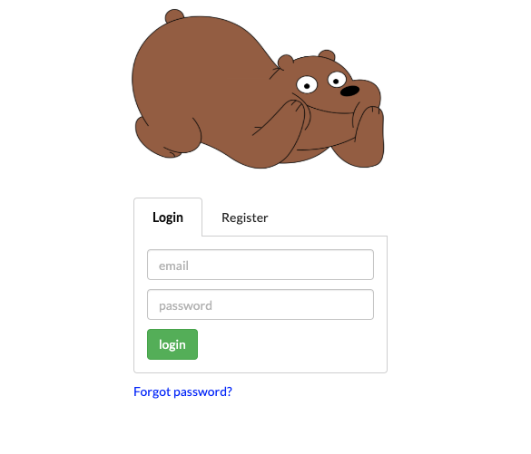
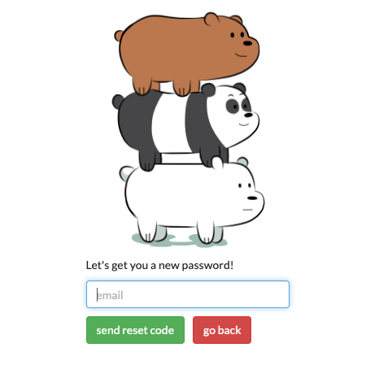
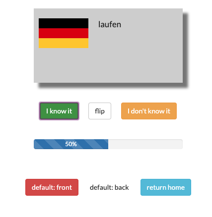

# cardy

A flashcard app built with Clojurescript and re-frame.

My first web app, designed to help me learn German before moving to Berlin. 

Visit the [Heroku-hosted app](https://cardy-flashcards.herokuapp.com/) to register and start studying!

## License

[MIT License](https://opensource.org/licenses/MIT).
